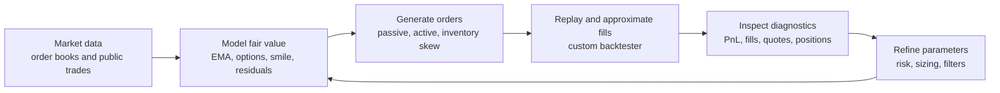

# IMC Prosperity 4 Trading Portfolio

Selected strategy, research and tooling files from my IMC Prosperity 4 competition work.

I was the team captain and designed the algorithmic and manual strategy stack represented here. The emphasis was on dynamic, model-led trading logic rather than brittle historical price anchors: fair values, volatility surfaces, residual filters, inventory controls, market replay and visual diagnostics.

## What This Shows

- **Trading research:** fair-value estimation, market making, options pricing, implied volatility, volatility-smile fitting, residual z-score filters and manual decision modelling.
- **Execution logic:** passive and active quote placement, inventory-aware sizing, position limits, stale-signal avoidance and product-level risk pruning.
- **Research infrastructure:** custom market replay backtester, fill approximation, parameter search and desktop visualizer for PnL, fills, quotes, positions and order-book state.
- **Risk judgement:** strategies were built to adapt to changing conditions rather than rely on hardcoded price levels that could fail after a regime change.

## Start Here

| Area | File | Why it matters |
| --- | --- | --- |
| Final strategy stack | `strategies/round5_dynamic_multi_asset_market_maker.py` | Dynamic multi-asset market maker using rolling fair values, warmup regimes, product-level risk pruning and inventory-aware quoting. |
| Options strategy | `strategies/round4_options_hydrogel_strategy.py` | Expanded options and hydrogel strategy using passive/active execution, signal filtering and risk controls. |
| Volatility research | `research/options_volatility_research.py` | Research support for option fair value, implied volatility and volatility-smile behaviour. |
| Backtester | `tools/backtester/run_backtest.py` | Custom replay engine for historical market data and fill approximation. |
| Visualizer | `tools/visualizer/prosperity_visualizer.py` | Desktop dashboard for inspecting market replay output, own quotes, fills, positions and PnL. |

## Research Loop



## Strategy Families

### Dynamic Multi-Asset Market Making

Represented by `strategies/round5_dynamic_multi_asset_market_maker.py`.

The round 5 strategy uses rolling fair values, warmup regimes and product-specific configuration. Products are traded only when live book state, edge thresholds and inventory constraints allow it.

Key ideas:

- EMA-style live fair-value estimates.
- Product-specific edge, size and soft-limit controls.
- Passive quoting with selective active overlays.
- Warmup logic to avoid overreacting early in a run.
- Inventory skew and position-limit-aware order sizing.

### Options And Volatility Modelling

Represented by `strategies/round3_options_smile_strategy.py`, `strategies/round4_options_hydrogel_strategy.py` and `research/options_volatility_research.py`.

The options stack combines Black-Scholes-style pricing, implied volatility estimation, cross-strike smile fitting and residual filters. Orders are gated by model edge, liquidity, position limits and stale-signal checks.

Key ideas:

- Black-Scholes call valuation.
- Implied volatility and volatility-smile fitting.
- Residual z-score filters.
- Delta-aware inventory skew.
- IV carry and stale-signal avoidance.
- Public-flow features where useful.

### Manual Trading Research

Represented by `research/manual_trading_decision_model.py` and `research/manual_population_simulation.py`.

Manual trading work used technical valuation and decision-distribution reasoning to model how other participants were likely to act under payoff uncertainty.

Key ideas:

- Scenario analysis under incomplete information.
- Population-level decision simulation.
- Payoff asymmetry and crowd-behaviour modelling.
- Regret-style reasoning.

## Tooling

| Tool | Purpose |
| --- | --- |
| `tools/backtester/run_backtest.py` | Replays historical Prosperity data against a strategy file defining a `Trader` class. Tracks positions, approximates fills and writes run summaries. |
| `tools/visualizer/prosperity_visualizer.py` | PySide6/PyQtGraph desktop dashboard for reviewing PnL, fills, own quotes, positions, order-book state and strategy comparisons. |
| `research/round5_parameter_optimizer.py` | Parameter-search workflow for product-level strategy tuning. |
| `research/round5_decision_report.py` | Decision/reporting support for comparing strategy variants. |

## Screenshots To Add

Screenshots are intentionally not included yet. The best screenshots for this repo would be:

| Priority | Screenshot | Suggested filename | What it should show |
| --- | --- | --- | --- |
| 1 | Visualizer overview | `docs/assets/screenshots/visualizer-overview.png` | Full dashboard with PnL, positions/fills and order-book/quote diagnostics visible. |
| 2 | Backtester run summary | `docs/assets/screenshots/backtester-run-summary.png` | A clean run summary or comparison table without local file paths or sensitive machine details. |
| 3 | Strategy comparison | `docs/assets/screenshots/strategy-comparison.png` | Parameter/variant comparison showing how strategies were evaluated. |
| 4 | Options research | `docs/assets/screenshots/options-volatility-research.png` | Volatility smile, residual or implied-volatility diagnostic plot. |

See `docs/screenshots.md` for capture guidance.

## Repository Structure

```text
strategies/       Selected final/substantive strategy files.
research/         Research, optimization and manual-trading analysis scripts.
tools/backtester/ Custom market replay and execution approximation tool.
tools/visualizer/ Desktop visualizer for run review and diagnostics.
docs/             Strategy notes, sanitization notes and screenshot plan.
```

## Data And Generated Outputs

Historical CSVs, generated run archives, logs, cache files, screenshots, spreadsheets and third-party research copies are intentionally excluded from this public portfolio repository. The goal is to keep the repository readable and focused on strategy design, modelling and research tooling.

## Status

This is a first public sanitized version. Next improvements:

- Add the screenshots listed above.
- Add a small anonymized/sample dataset if useful.
- Clean selected scripts with more consistent docstrings.
- Add example commands once a small sample dataset is available.
