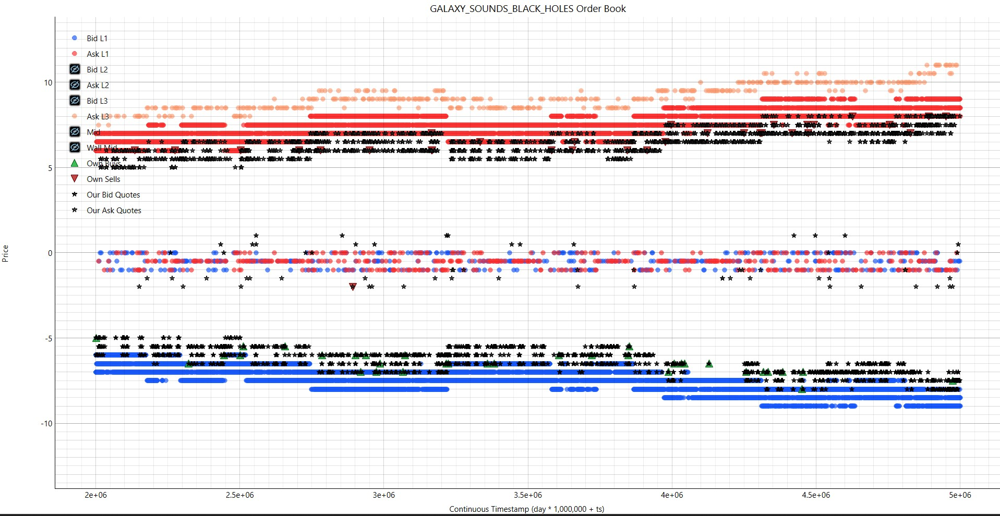
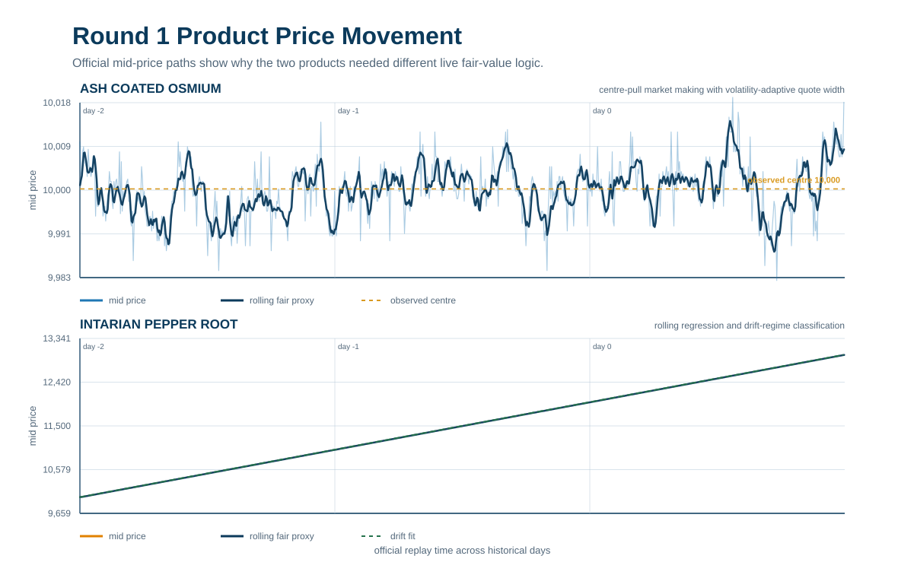
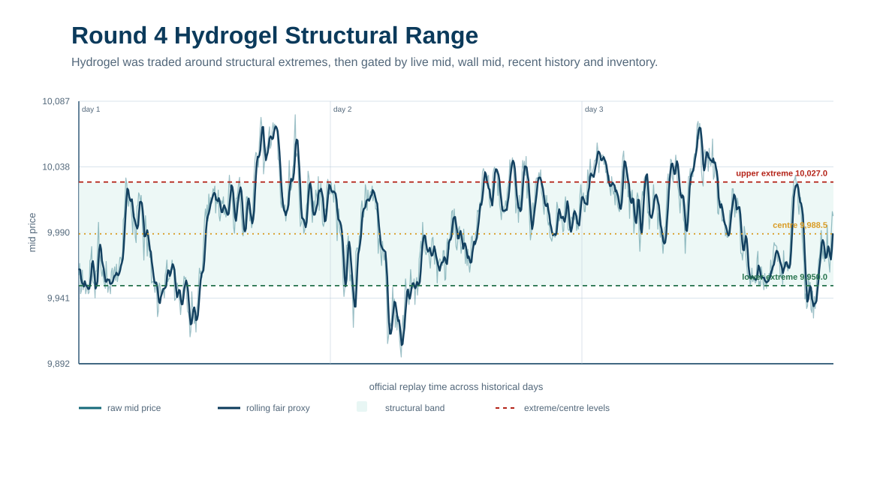
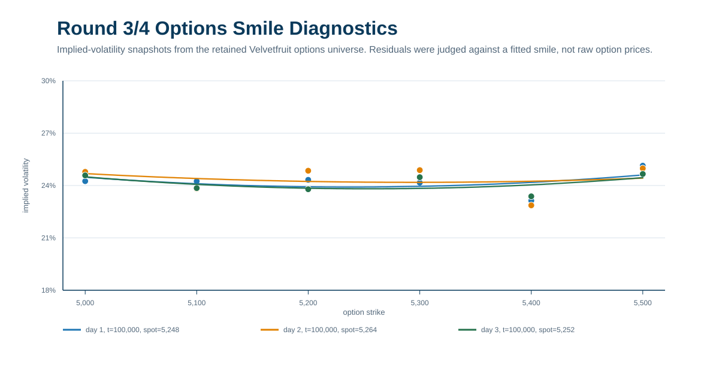
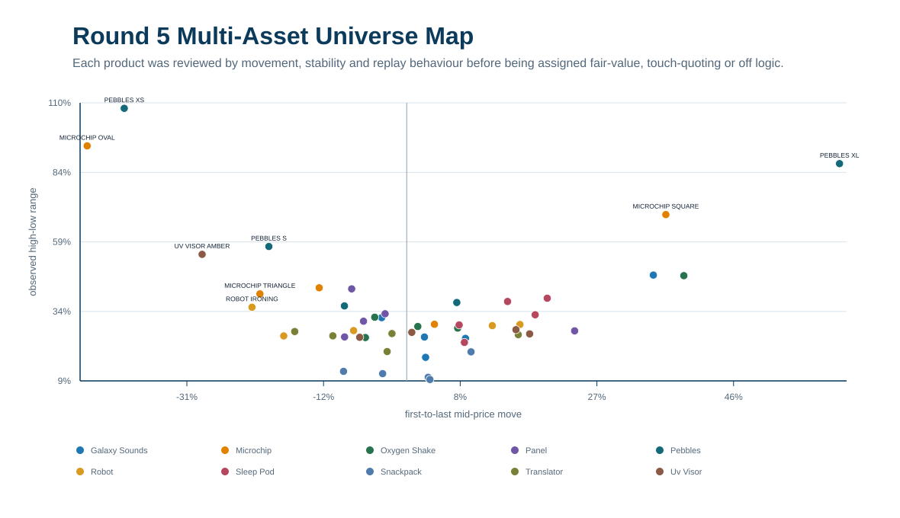
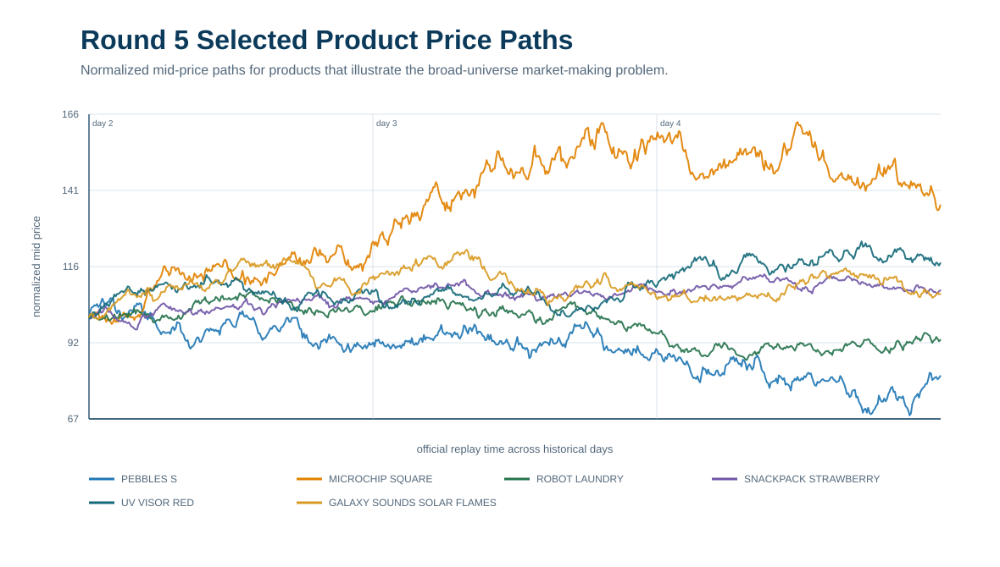
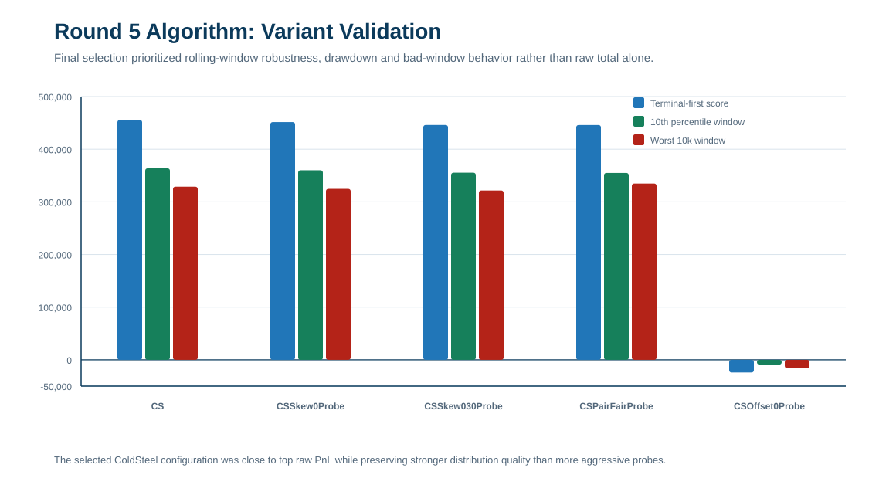

# IMC Prosperity 4 Trading Challenge

Selected strategy, research and tooling files from my IMC Prosperity 4 competition work.

IMC Prosperity 4 (2026) was a global quantitative trading competition held over five rounds across a two-week period, with more than 30,000 students and more than 22,000 registered teams participating worldwide.

Participants built trading algorithms to maximize profit in simulated securities and commodities markets populated by bots, market frictions and hidden behavioural patterns. Across the competition, new products, mechanics and sources of market structure were introduced each round, requiring teams to continuously adapt their strategies, models and research workflows. In total, 64 products were traded throughout the competition, with 50 active in the final round alone.

Each round also included a separate manual trading challenge focused on probabilistic reasoning, optimization and strategic decision-making in uncertain, adversarial environments. The competition covered market making, statistical arbitrage, microstructure analysis, derivatives pricing, signal extraction, event-driven trading, optimization, simulation and game theory.

I captained a four-person team and personally designed the algorithmic strategies, manual models, research tooling and final trading decisions. We finished:

| Result | Finish |
| --- | ---: |
| Overall global rank | 343rd, top 1.5% |
| Algorithmic trading rank | 562nd, top 2.5% |
| Manual trading rank | 148th, top 0.7% |
| Singapore rank | 7th |

Before the competition began, I reviewed the previous year's leaderboard and looked at country representation around the top 1-2% of the field, which is where I expected us to place. Singapore looked underrepresented relative to its status as a global trading hub, so I chose to compete under Singapore rather than simply defaulting to Ireland. That did not go fully to plan because Singapore had a much larger and stronger field this year, but we still finished 7th in a sophisticated and competitive trading region.

## Core Philosophy

The defining choice in this repo is deliberate: I avoided fixed-price hardcoding.

A lot of successful Prosperity strategies can be built by identifying historical price anchors and optimizing aggressively around those exact numbers. I treated that as fragile and against the spirit of the challenge. If a regime changed, those bots could make serious losses. My preference was to sacrifice some headline PnL in exchange for dynamic, regime-adaptive logic: rolling fair values, volatility surfaces, residual filters, inventory controls, market replay and visual diagnostics.

That philosophy is the reason this repository emphasizes research process and risk judgement as much as final PnL.

## Research Tooling

Before discussing the individual rounds, it is worth showing the research loop. I built a custom backtester and visualizer from scratch because the hardest part of the challenge was not writing one strategy file; it was understanding why a strategy made or lost money under replay.

The workflow was:

1. Load official price and trade CSVs.
2. Replay the market locally through the same `Trader` interface used by the competition.
3. Approximate fills, PnL, inventory, quotes and order-book state.
4. Compare strategy variants over full runs and rolling windows.
5. Inspect the run visually, diagnose failures and decide what should be simplified, pruned or rebuilt.

The tooling supported local market replay, simulated fills, PnL and inventory tracking, own quote/fill inspection, strategy comparison, parameter sweeps and post-round diagnostics. The visualizer and backtester will eventually live in their own dedicated repositories, but this repository includes representative code and screenshots because they were central to the actual research process.





Additional screenshots and capture notes are in `docs/screenshots.md`.

## Market Structure Snapshots

The following charts were generated from the official price CSVs in my private competition workspace. The raw CSVs are intentionally excluded from this public repository, but these derived visuals help explain the market structure the strategies were built around.









## Competition Structure

Prosperity 4 had two phases:

| Phase | Rounds | Scoring implication |
| --- | --- | --- |
| Qualification / playoffs | Rounds 1-2 | Teams needed more than 200k PnL to reach the finals. |
| Finals | Rounds 3-5 | PnL reset to zero. Final leaderboard PnL came only from Rounds 3-5. |

After a strong Round 1, we treated Round 2 as a qualification risk-control problem. We submitted no algorithmic trades in Round 2 and used the manual allocation to guarantee enough profit to advance. That was less exciting than maximizing Round 2 PnL, but it was the correct tournament decision.


## Performance By Round

| Round | Phase | Manual PnL | Algo PnL | Official cumulative PnL | Leaderboard rank | Main decision |
| --- | --- | ---: | ---: | ---: | ---: | --- |
| 1 | Qualification | 87,995 | 98,618 | 186,613 | 625 | Dynamic market making plus auction optimization. |
| 2 | Qualification | 24,233 | 0 | 210,846 | 3,927 | No algorithmic risk; guaranteed-profit manual allocation to qualify. |
| 3 | Finals reset | 76,707 | 19,368 | 96,075 | 1,171 | Hydrogel and options strategy; live logging/character-limit issue hurt execution. |
| 4 | Finals | 35,536 | 72,480 | 204,090 | 721 | Hydrogel structural model plus options; risk-aware manual options book. |
| 5 | Finals | 124,594 | 57,344 | 386,028 | 343 | Broad multi-asset market making plus news-driven manual allocation. |


## Start Here

| Area | File | Why it matters |
| --- | --- | --- |
| Round 1 strategy | `strategies/round1_osmium_pepper_dynamic_strategy.py` | Dynamic fair-value and market-making strategy for Ash-Coated Osmium and Intarian Pepper Root. |
| Round 2 risk decision | `strategies/round2_no_algo_qualification_risk_control.py` | Explicit no-trade algorithmic submission after qualification was effectively secured. |
| Round 3 options strategy | `strategies/round3_options_smile_strategy.py` | Public-safe options and Velvetfruit strategy using Black-Scholes valuation, implied volatility, smile fitting and residual filters; the private Round 3 stack also included Hydrogel structural trading. |
| Round 4 strategy | `strategies/round4_options_hydrogel_strategy.py` | Hydrogel and options strategy using adaptive levels, public-flow features and volatility modelling. |
| Round 5 strategy | `strategies/round5_dynamic_multi_asset_market_maker.py` | Dynamic multi-asset market maker using rolling fair values, product risk controls and inventory-aware quoting. |
| Manual trading notes | `docs/manual-trading.md` | Workbook-derived explanation of each manual challenge and final choice. |
| Strategy notes | `docs/strategy-summary.md` | Public-safe explanation of the algorithmic stack by round. |
| Research notes | `docs/research-notes.md` | Modelling philosophy, validation loop and research tooling. |
| Backtester | `tools/backtester/run_backtest.py` | Custom replay engine for historical market data and fill approximation. |
| Visualizer | `tools/visualizer/prosperity_visualizer.py` | Desktop dashboard for inspecting PnL, fills, quotes, inventory and order-book state. |

## Round 1: Dynamic Fair Values And Auction Thresholds

### Algorithmic Challenge

Round 1 traded `ASH_COATED_OSMIUM` and `INTARIAN_PEPPER_ROOT`.

The Round 1 price chart above shows why I separated the products rather than using one generic market-making template. Osmium mostly behaved like a centre-pull product with short bursts away from fair value, while Pepper Root had a cleaner directional drift component. That split drove the code structure: one strategy was primarily inventory-aware market making around a live centre, the other leaned more heavily on rolling regression and drift-regime classification.

`ASH_COATED_OSMIUM` behaved like a market-making problem around a live centre. The strategy estimated fair value from a blend of short/long rolling history, order-book mid, order-book imbalance and a pull back toward the observed centre. It then combined two execution modes:

- take liquidity only when the best ask or bid was favourable versus fair value after an edge threshold;
- place passive quotes around an inventory-skewed fair value, with wider quotes and smaller size when recent mid-price movement increased.

`INTARIAN_PEPPER_ROOT` had a more directional component. The strategy kept a rolling regression over recent ticks, estimated slope and R2, then classified the market into `very_strong_drift`, `strong_drift`, `mid_drift` or `flat`. The regime controlled the core target position, passive quote offsets and when to take or fade the book.

The important point is that both products were traded from live estimates. The strategy did not simply assume a fixed centre and optimize around it.

### Manual Challenge

The manual challenge was an auction clearing-price problem. The key insight was that our submitted price determined eligibility and priority, but our PnL came from the clearing price. That made the optimal quantity sit just below the threshold where the clearing price jumped.


Final decision:

| Product | Side | Submitted price | Quantity | Clearing price | Profit/unit | Manual PnL |
| --- | --- | ---: | ---: | ---: | ---: | ---: |
| `DRYLAND_FLAX` | Buy | 30 | 9,999 | 29 | 1.0 | 9,999 |
| `EMBER_MUSHROOM` | Buy | 17 | 19,999 | 16 | 3.9 | 77,996 |

The spreadsheet logic-based approach was also checked with brute force, and both methods produced the same optimal trade.

## Round 2: Qualification As A Risk-Control Problem

### Algorithmic Challenge

Round 2 was intentionally a no-trade algorithmic round.

Because Round 1 left us close to the 200k qualification threshold, the objective changed from maximizing immediate PnL to protecting the path into the finals. The public strategy file returns empty orders by design. This was not a missing strategy; it was a tournament decision.

### Manual Challenge

The manual problem was a budget allocation across Research, Scale and Speed. Research and Scale were mainly functions of our own allocation. Speed depended on how our Speed choice ranked against the rest of the field, which made the problem game-theoretic.

The modelling process was:

1. Optimize Research and Scale under a simple assumed Speed distribution.
2. Estimate uninformed teams that would not model the field deeply.
3. Estimate semi-informed teams that would find a simple best response.
4. Estimate well-informed teams that would model the previous groups.
5. Choose against the mixed population distribution.

The model found much higher-EV allocations than the one we submitted. The best decision possible was 43% Speed / 42% Scale / 15% Research. Our model made a proposed decision which produced just over 95% of the maximum PnL obtainable. But it was not needed for qualification.


Final submission:

| Research | Scale | Speed | Result |
| ---: | ---: | ---: | ---: |
| 23% | 77% | 0% | 24,233 |

The final allocation was a deliberately conservative guaranteed-profit choice. It advanced us to the finals without exposing the team to unnecessary playoff risk.

## Round 3: Hydrogel, Options Smile Research, Execution Lesson And Two-Bid Game Theory

### Algorithmic Challenge

Round 3 traded `HYDROGEL_PACK`, `VELVETFRUIT_EXTRACT` and options across multiple `VELVETFRUIT_EXTRACT` strikes. The strategy was built as a set of sleeves rather than one monolithic predictor: Hydrogel structural market making, Velvetfruit fair-value estimation, options valuation, residual trading and controlled passive quoting.

The Hydrogel sleeve was a continuation of the dynamic/non-hardcoded philosophy. The private Round 3 strategy used structural lower and upper regions as risk landmarks, but still recalculated execution fair value from order-book state and recent history. It used an anchor centre, tiered inventory targets near extremes, passive quote gates and active sweeps only when the edge and target inventory justified it.

`VELVETFRUIT_EXTRACT` mattered both as a tradeable product and as the underlying for the options book. I used it to form a live spot estimate for Black-Scholes valuation, delta exposure and residual diagnostics. Where the spread and fair value justified it, the strategy could also quote the underlying directly, but the bigger research focus was the options surface.

The research stack used:

- Black-Scholes-style call valuation;
- implied volatility estimation from observed option prices;
- weighted quadratic smile fitting across strikes;
- leave-one-out checks so each option was not valued by a model overly dependent on itself;
- residual and z-score filters before trading a mispriced contract;
- delta-aware inventory skew so the options book did not accidentally become a large underlying bet;
- dynamic sizing based on edge, spread and residual strength;
- passive market making on selected contracts when the spread justified inventory risk;
- active residual trades where model edge was large enough to cross the spread;
- zero-bid lottery logic on far out-of-the-money options;
- microstructure scalp logic only where book state and residual evidence agreed.

The options-smile chart above is the kind of structure I was trying to trade. The aim was not to decide that one option price was cheap in isolation; it was to infer the live volatility surface, compare each option against the surface, and only trade residuals that were large enough after spread, inventory and signal-quality checks.

Further post-round research showed an even stronger pattern: the IV mispricings themselves were mean-reverting. That was exactly the type of signal the residual framework was meant to detect, but the fully developed residual mean-reversion version came too late to add safely into the live Round 3 code.

The strategy had several layers: Hydrogel structural trading, passive options market making around model fair value, active residual trades when the option looked mispriced, small zero-bid lottery logic on far strikes, IV carry logic and underlying exposure control.

The live result was hurt by a production-style issue. My research/logging payload exceeded the platform character limit during the official run, which interfered with quote submission. I only diagnosed this properly in Round 4 while reviewing Round 3 performance. The lesson was blunt but valuable: instrumentation must never be allowed to interfere with execution.

### Manual Challenge

The manual problem was a two-bid reserve-price problem. The payoff depended on our first bid, our second bid, the reserve distribution and the average second bid of the rest of the field. The second bid carried a crowd-dependent penalty, so the problem was not solved by maximizing against one assumed population average.

The model again separated participants into informed, semi-informed and less-informed groups. Candidate bid pairs were stress-tested under:

- central expected average bid;
- upward-skewed average bid;
- downside average scenario;
- overall robustness score.


Final submission:

| First bid | Second bid | Manual PnL |
| ---: | ---: | ---: |
| 791 | 856 | 76,707 |

The final pair was chosen because it balanced capture probability and robustness to population skew. It was not simply the most aggressive or most optimistic bid pair.

## Round 4: Hydrogel Structure, Options Rebuild And A Risk-Aware Manual Options Book

### Algorithmic Challenge

Round 4 retained the options universe and added `HYDROGEL_PACK`.

The Hydrogel chart above shows the structure I was exploiting. I used lower, centre and upper structural levels as risk landmarks, but the strategy still recalculated execution fair value from live order-book information and recent history. The levels told the bot when the market was becoming interesting; they were not a complete substitute for live pricing.

The hydrogel model was built around adaptive structural levels rather than a single hardcoded fair value. The strategy maintained an anchor centre, lower/upper extremes, tiered target positions near those extremes and a live signal fair value constructed from wall mid, top-of-book mid and recent anchor history. It traded actively near structural extremes and passively when the quoted edge was large enough.

Key components:

- adaptive lower/upper levels around a rolling centre;
- tiered long/short targets near lower and upper extremes;
- inventory-aware passive quoting;
- dynamic low detection using recent history, standard deviation and bounce checks;
- public-flow and named-counterparty features where they were useful;
- the Round 3 options stack, but with reduced logging and safer production behaviour.

Round 4 also added named-counterparty information. I researched this and built small signal overlays rather than letting it dominate the strategy. In Hydrogel, `Mark 38` trades were tracked as a short-lived directional bias, with extra passive size only when the signal appeared near useful parts of the recent price distribution. In the options book, `Mark 22` selling and `Mark 01` buying were tested as out-of-the-money call signals, while `Mark 14` and `Mark 67` activity in the underlying were tested as call-bias inputs for selected strikes.

These counterparty signals were interesting but not especially effective as standalone alpha. I treated them as small biases layered on top of the structural Hydrogel model and the options residual model, not as signals strong enough to override price, spread, edge and inventory constraints.

This round was where post-round diagnosis mattered. The Round 3 character-limit issue was identified, the logging surface was reduced and the strategy became more production-safe.

### Manual Challenge

The manual problem was an Aether Crystal options portfolio. I treated it like a one-off risk book rather than a puzzle with one obvious answer.

The workflow was:

- brute-force candidate option combinations;
- simulate and bootstrap candidate PnL distributions;
- compare EV, probability of loss, 1st percentile, 5th percentile, median and upper-tail outcomes;
- choose based on expected value and lower-tail protection rather than lottery-like upside.


Final choice was Strategy 3:

| Instrument | Signed volume | Order |
| --- | ---: | --- |
| `AC_50_P` | 6 | Buy 6 |
| `AC_50_C` | 8 | Buy 8 |
| `AC_35_P` | -50 | Sell 50 |
| `AC_45_P` | 50 | Buy 50 |
| `AC_50_P_2` | 5 | Buy 5 |
| `AC_50_C_2` | 1 | Buy 1 |
| `AC_50_CO` | -8 | Sell 8 |
| `AC_40_BP` | -50 | Sell 50 |
| `AC_45_KO` | 27 | Buy 27 |

In hindsight, this round had a large realized-luck component and high-variance submissions were rewarded more than I expected. Still, the decision matched our philosophy: seek positive, repeatable PnL rather than maximizing one-round upside at the cost of large downside.

## Round 5: Broad Multi-Asset Market Making And News Allocation

### Algorithmic Challenge

Round 5 expanded the universe dramatically. The final strategy was a broad dynamic market maker with product-specific modes.

The universe map and selected price-path chart show why Round 5 needed product-level decisions. Some products had strong directional moves, some had wide ranges without useful replay behaviour, and some were stable enough for touch-quoting. The strategy therefore treated inclusion as a research decision rather than assuming every listed product deserved capital.



Each product was assigned a mode:

- `fair`: quote only when attractive versus a live EMA fair value;
- `touch`: quote one tick inside both sides with soft limits;
- `off`: include in the universe but skip when testing showed weak or unstable results.

The strategy tracked EMA fair values across multiple windows, used warmup configurations before long-window estimates were mature, scaled sizes by inventory, applied hard position limits and pruned weak overlays. The research loop was not just "highest backtest PnL wins"; it looked at rolling 10k-window behaviour, worst window, lower-tail windows and drawdown.



The selected configuration was close to the best raw PnL, while preserving stronger distribution quality than several more aggressive probes. This was the clearest expression of the dynamic approach: broad market making, live fair values, conservative sizing and continuous pruning rather than a fixed-price map.

### Manual Challenge

The manual task required translating qualitative news into directional trades under a fee structure that penalized large allocations.

The model converted each article into:

- direction: buy or sell;
- severity of expected price impact;
- confidence in the interpretation;
- fee-adjusted expected value;
- optimized position size.


Final allocation was 71% of capital. The workbook expected about 10.25% return, and the realized manual PnL was 124,594.

## Quickstart

The original Prosperity CSVs are intentionally excluded, but this repo includes a small synthetic dataset so the public backtester can be run end to end:

```bash
python tools/backtester/run_backtest.py --strategy examples/demo_mean_reversion_strategy.py --data-dir examples/sample_data --out-dir examples/demo_runs --separate-days
```

Expected result: the command writes a run archive and JSON summary under `examples/demo_runs/`, with nonzero fills, PnL and risk statistics. Generated demo runs are ignored by git.

## Repository Structure

```text
strategies/       Selected final/substantive strategy files.
research/         Research, optimization and manual-trading analysis scripts.
tools/backtester/ Custom market replay and execution approximation tool.
tools/visualizer/ Desktop visualizer for run review and diagnostics.
examples/         Tiny synthetic dataset and demo strategy for public backtester verification.
docs/             Strategy notes, manual trading notes, sanitization notes and screenshots.
```

## Data And Generated Outputs

Historical CSVs, generated run archives, logs, cache files, spreadsheets and third-party research copies are intentionally excluded from this public portfolio repository. A small set of curated screenshots and summary graphics is included to show the research tooling without publishing raw generated artifacts.

This repo is intended to show strategy design, modelling, risk judgement and research tooling. It is not intended to be a turnkey reproduction of the private competition workspace.
