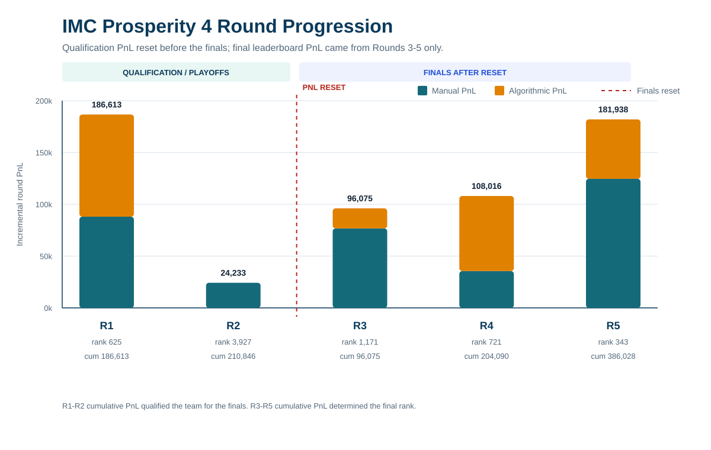
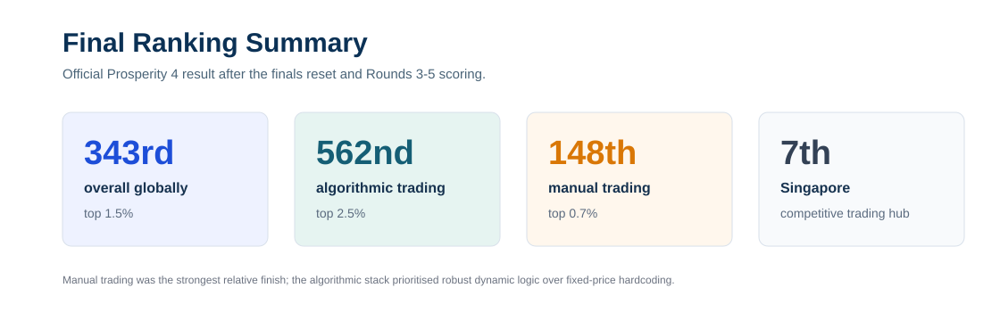
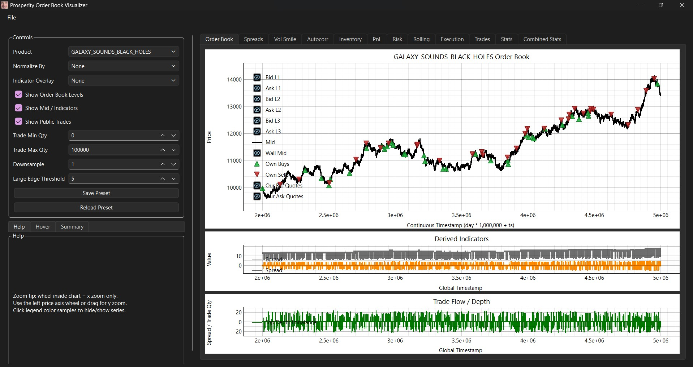
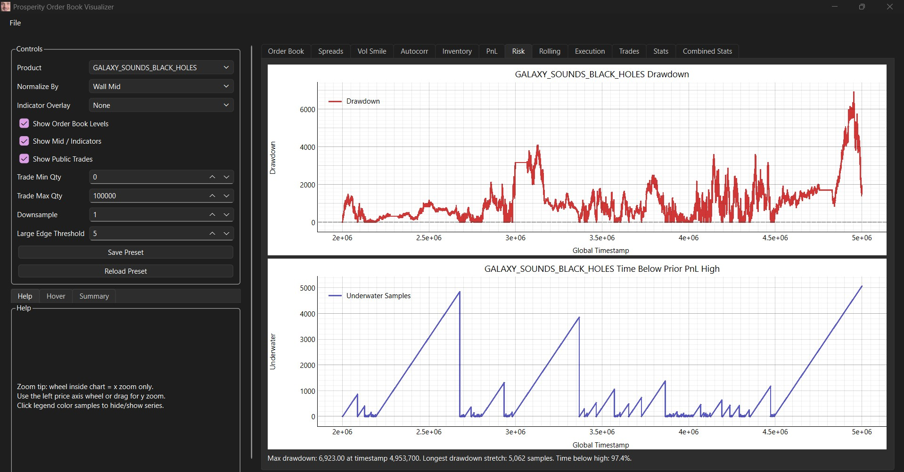
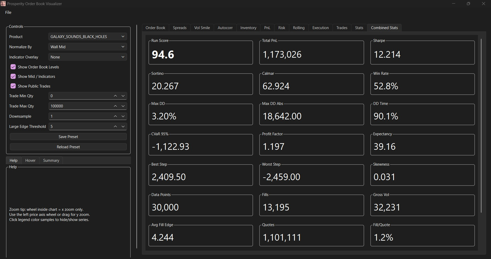

# IMC Prosperity 4 Trading Portfolio

Selected strategy, research and tooling files from my IMC Prosperity 4 competition work.

I captained a four-person team and personally designed the algorithmic strategies, manual models, research tooling and final trading decisions. We finished:

| Result | Finish |
| --- | ---: |
| Overall global rank | 343rd, top 1.5% |
| Algorithmic trading rank | 562nd, top 2.5% |
| Manual trading rank | 148th, top 0.7% |
| Singapore rank | 7th |

Before the competition began, I reviewed the previous year's leaderboard and noticed that Singapore was underrepresented in the top 1-2% of the field, which is where I expected us to place. I chose to compete under Singapore because it is one of the world's most sophisticated trading hubs and I wanted to benchmark the team against a stronger region. That did not go fully to plan because this year Singapore had a much larger and stronger field, but we still finished 7th in Singapore.

## Core Philosophy

The main design choice in this repo is deliberate: I avoided fixed-price hardcoding.

A lot of successful Prosperity strategies can be built by identifying an historical price anchor and optimizing a bot around that exact level. I treated that as fragile and likely against the spirit of the challenge. If the regime changed, those bots could suffer serious losses. My preference was to sacrifice some headline PnL in exchange for dynamic, regime-adaptive logic: fair values, rolling estimates, volatility surfaces, residual filters, inventory controls, market replay and visual diagnostics.

That philosophy is the reason this repository emphasizes research process and risk judgement as much as final PnL.

## Competition Structure

Prosperity 4 had two phases:

| Phase | Rounds | Scoring implication |
| --- | --- | --- |
| Qualification / playoffs | Rounds 1-2 | Teams needed more than 200k PnL to reach the finals. |
| Finals | Rounds 3-5 | PnL reset to zero. Final leaderboard PnL came only from Rounds 3-5. |

After a strong Round 1, we treated Round 2 as a qualification risk-control problem. We submitted no algorithmic trades in Round 2 and used a manual allocation that guaranteed enough profit to reach the finals. That was less exciting than maximizing Round 2 PnL, but it was the correct tournament decision.



## Performance By Round

| Round | Phase | Manual PnL | Algo PnL | Official cumulative PnL | Leaderboard rank | Notes |
| --- | --- | ---: | ---: | ---: | ---: | --- |
| 1 | Qualification | 87,995 | 98,618 | 186,613 | 625 | Dynamic market making and auction optimization. |
| 2 | Qualification | 24,233 | 0 | 210,846 | 3,927 | No algo risk; guaranteed-profit manual allocation to qualify. |
| 3 | Finals reset | 76,707 | 19,368 | 96,075 | 1,171 | Options strategy suffered from an execution/logging character-limit issue. |
| 4 | Finals | 35,536 | 72,480 | 204,090 | 721 | Hydrogel plus options; positive result despite high-variance manual round. |
| 5 | Finals | 124,594 | 57,344 | 386,028 | 343 | Broad multi-asset market making, dynamic fair values and news allocation. |



## Start Here

| Area | File | Why it matters |
| --- | --- | --- |
| Round 1 strategy | `strategies/round1_osmium_pepper_dynamic_strategy.py` | Dynamic fair-value and market-making strategy for Ash-Coated Osmium and Intarian Pepper Root. |
| Round 2 risk decision | `strategies/round2_no_algo_qualification_risk_control.py` | Explicit no-trade algorithmic submission after qualification was effectively secured. |
| Round 3 options strategy | `strategies/round3_options_smile_strategy.py` | Options strategy using Black-Scholes valuation, implied volatility, smile fitting and residual filters. |
| Round 4 strategy | `strategies/round4_options_hydrogel_strategy.py` | Hydrogel and options strategy using adaptive levels, public-flow features and volatility modelling. |
| Round 5 strategy | `strategies/round5_dynamic_multi_asset_market_maker.py` | Dynamic multi-asset market maker using rolling fair values, product risk controls and inventory-aware quoting. |
| Manual trading notes | `docs/manual-trading.md` | Round-by-round manual decision models and final choices. |
| Strategy notes | `docs/strategy-summary.md` | Public-safe explanation of the algorithmic stack by round. |
| Research notes | `docs/research-notes.md` | Modelling philosophy, validation loop and research tooling. |
| Backtester | `tools/backtester/run_backtest.py` | Custom replay engine for historical market data and fill approximation. |
| Visualizer | `tools/visualizer/prosperity_visualizer.py` | Desktop dashboard for inspecting PnL, fills, quotes, inventory and order-book state. |

## Algorithmic Challenge

### Round 1

Round 1 traded `ASH_COATED_OSMIUM` and `INTARIAN_PEPPER_ROOT`. The strategy was intentionally adaptive:

- Osmium used a rolling fair value blended from short/long history, order-book mid, order-book imbalance and a pull toward the observed centre.
- Quotes were inventory-aware and volatility-adaptive: larger in calmer regimes, smaller when recent mid-price movement increased.
- Pepper used rolling linear regression on recent ticks to estimate slope, R2 and drift regime.
- Pepper execution combined a core target position, regime-specific overlays, book-level signals and passive quotes around the live fair value.

This was the first major example of the non-hardcoded approach. Where other teams could anchor directly around historical constants, I preferred to estimate fair value continuously from live market state.

### Round 2

Round 2 was a strategic tournament decision, not an algorithmic build. Because Round 1 PnL left us close to the qualification threshold, I submitted no algorithmic orders and used the manual trade to lock a guaranteed path into the finals.

The public strategy file returns empty orders by design.

### Round 3

Round 3 introduced `VELVETFRUIT_EXTRACT` and call options across multiple strikes. The options strategy used:

- Black-Scholes-style call valuation.
- Implied volatility estimation.
- Cross-strike volatility-smile fitting.
- Leave-one-out model checks.
- Residual z-score filters.
- Delta-aware inventory skew.
- Microstructure scalp logic where the signal survived testing.

The underlying idea was strong, but the live result was hurt by an implementation issue: my research/logging payload exceeded the character limit during the official run, which caused quotes to stop reaching the platform. I only diagnosed this properly while reviewing Round 4 performance. It was a frustrating but useful production-style lesson: instrumentation must never be allowed to interfere with execution.

### Round 4

Round 4 retained the options stack and added `HYDROGEL_PACK`. The strategy extended the Round 3 options model and added:

- Adaptive hydrogel levels around a rolling centre.
- Tiered position targets near lower and upper extremes.
- Passive and active quoting around live fair value.
- Public-flow and named-counterparty features where useful.
- Options residual, IV and delta-aware execution layers.

This was also where the post-round review process became more valuable. The Round 3 character-limit issue was identified, the logging was reduced, and the strategy was made more production-safe.

### Round 5

Round 5 expanded the universe to many product families. The initial research surface was huge, so I focused on what survived validation rather than chasing every beautiful backtest.

The final stack used:

- Rolling EMA fair values across multiple windows.
- Product-specific `fair`, `touch` and `off` modes.
- Warmup regimes before long-window estimates were trusted.
- Inventory-scaled sizing and soft/hard position limits.
- Trend overlays only where they were robust enough to keep.
- Product pruning when replay showed weak PnL, high drawdown or poor fill quality.

This is the clearest expression of the dynamic approach: broad market making, live fair values, conservative sizing and continuous pruning rather than a brittle fixed-price map.

## Manual Challenge

The manual work was a major strength of the run: 148th globally, top 0.7%.

Manual rounds were treated as quantitative decision problems. Some were explicit optimization problems; others required modelling how other teams would behave under incomplete information. The common process was:

1. Model the payoff function.
2. Identify the population/crowding component.
3. Simulate informed, semi-informed and uninformed groups where relevant.
4. Compare EV against lower-tail risk.
5. Review the realized distribution after each round to understand what the model got right or wrong.

See `docs/manual-trading.md` for the full round-by-round write-up.

## Research Tooling

I built a custom backtester and visualizer from scratch to shorten the research loop. These will eventually live in their own dedicated repositories, but the current repo includes representative code and screenshots.

The tools supported:

- local market replay;
- simulated fills;
- PnL and inventory tracking;
- own quote/fill inspection;
- strategy comparison;
- parameter sweeps;
- post-round diagnostics.







Additional screenshots and capture notes are in `docs/screenshots.md`.

## Quickstart

The original Prosperity CSVs are intentionally excluded, but this repo includes a small synthetic dataset so the public backtester can be run end to end:

```bash
python tools/backtester/run_backtest.py --strategy examples/demo_mean_reversion_strategy.py --data-dir examples/sample_data --out-dir examples/demo_runs --separate-days
```

Expected result: the command writes a run archive and JSON summary under `examples/demo_runs/`, with nonzero fills, PnL and risk statistics. Generated demo runs are ignored by git.

## Repository Structure

```text
strategies/       Selected final/substantive strategy files.
research/         Research, optimization and manual-trading analysis scripts.
tools/backtester/ Custom market replay and execution approximation tool.
tools/visualizer/ Desktop visualizer for run review and diagnostics.
examples/         Tiny synthetic dataset and demo strategy for public backtester verification.
docs/             Strategy notes, manual trading notes, sanitization notes and screenshots.
```

## Data And Generated Outputs

Historical CSVs, generated run archives, logs, cache files, spreadsheets and third-party research copies are intentionally excluded from this public portfolio repository. A small set of curated screenshots and summary graphics is included to show the research tooling without publishing raw generated artifacts.

This repo is intended to show strategy design, modelling, risk judgement and research tooling. It is not intended to be a turnkey reproduction of the private competition workspace.
