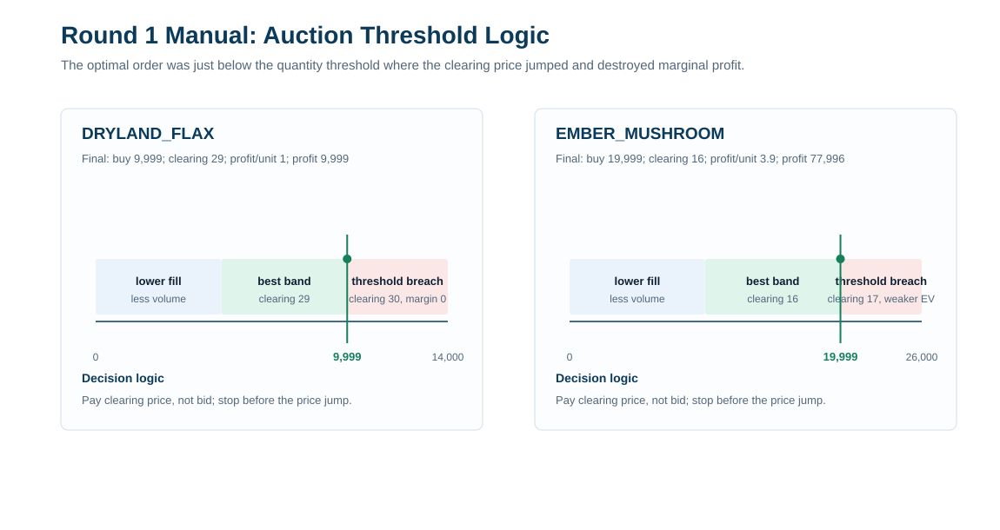
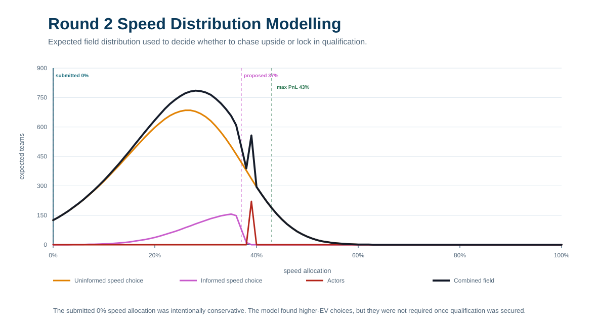
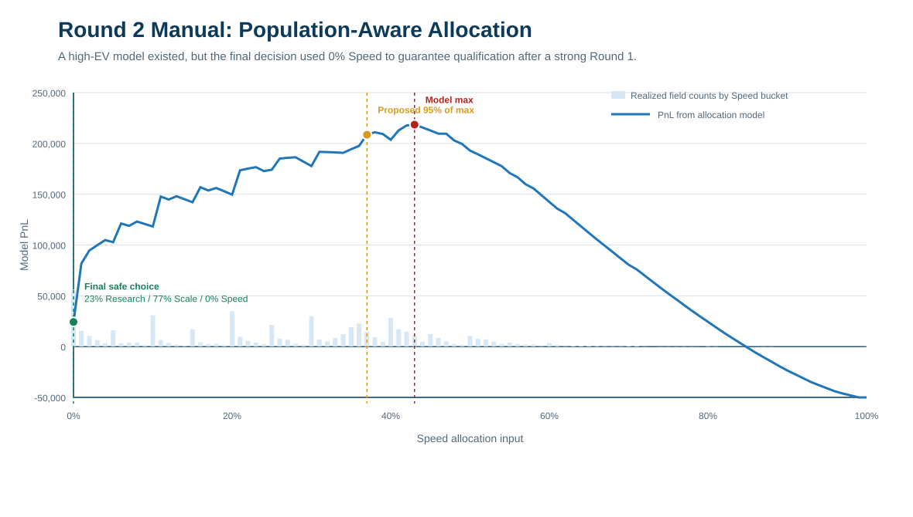
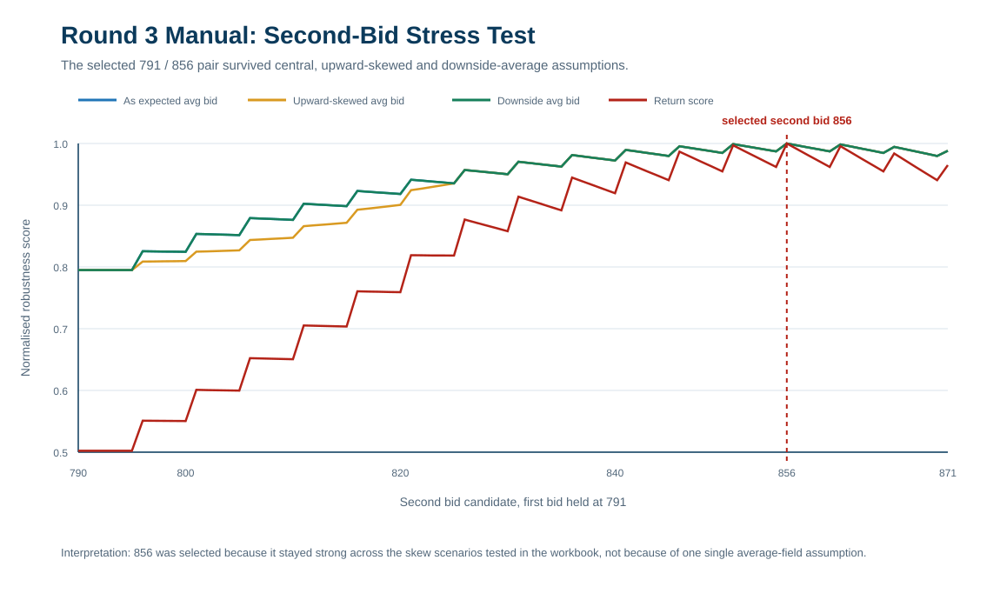
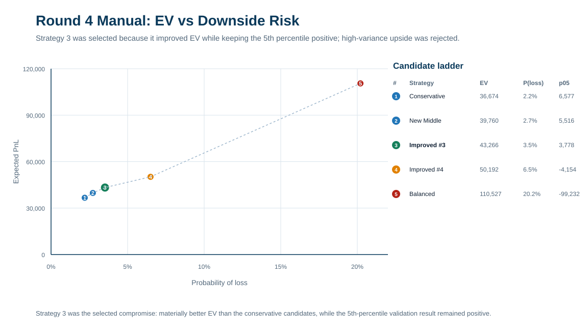
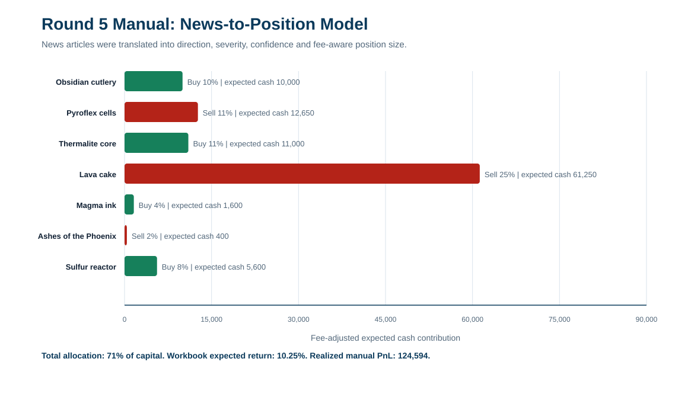

# Manual Trading Notes

Public-safe summary of my manual trading work from IMC Prosperity 4. The original spreadsheets are intentionally excluded from this repository, but the modelling approach, final decisions and workbook-derived summary visuals are included here.

Manual trading was one of the strongest parts of the run: 148th globally, top 0.7%.

## Round Summary

| Round | Challenge type | Final decision | Manual PnL |
| --- | --- | --- | ---: |
| 1 | Auction clearing-price optimization | Buy 9,999 `DRYLAND_FLAX` at 30; buy 19,999 `EMBER_MUSHROOM` at 17. | 87,995 |
| 2 | Strategic allocation / qualification risk | Research 23%, Scale 77%, Speed 0%. | 24,233 |
| 3 | Two-bid reserve-price problem | First bid 791, second bid 856. | 76,707 |
| 4 | Aether Crystal options portfolio | Strategy 3: EV/drawdown-aware options set. | 35,536 |
| 5 | News-driven commodity allocation | 71% capital allocation across directional news trades. | 124,594 |

## Process

The manual rounds were not treated as intuition puzzles. They were quantitative decision problems:

1. Translate the rules into a payoff function.
2. Identify what depended only on our action and what depended on the field.
3. Where the field mattered, model informed, semi-informed and uninformed groups separately.
4. Compare expected value against lower-tail risk and tournament context.
5. Review the realized distribution after each round to understand where the model was right or wrong.

This post-round review process mattered. It helped distinguish good reasoning that was unlucky from weak assumptions that needed correcting.

## Round 1: Auction Clearing-Price Optimization

The first manual round was a one-shot auction problem on `DRYLAND_FLAX` and `EMBER_MUSHROOM`.

For each product, we submitted one buy order after the existing order book was known. The auction selected the clearing price that maximized traded volume, with a higher-price tie-break. Because our order was added last, queue position mattered: if we joined an existing price level, we were behind all existing demand at that level.

The key insight was that we paid the clearing price, not necessarily our submitted bid. That meant the optimal trade sat just below the quantity threshold where one extra unit pushed the clearing price higher and reduced or destroyed profit.

### DRYLAND_FLAX

- Guaranteed resale price: 30.
- Base clearing price without our order: 28.
- Submitting at 30 improved priority versus joining the lower queue.
- Quantity region 5,000 to 9,999 forced a clearing price of 29 and remained profitable.
- At 10,000 units, the auction moved to a 30 clearing price, eliminating the margin.

Final order:

| Product | Side | Price | Quantity | Clearing price | Profit/unit | Profit |
| --- | --- | ---: | ---: | ---: | ---: | ---: |
| `DRYLAND_FLAX` | Buy | 30 | 9,999 | 29 | 1.0 | 9,999 |

### EMBER_MUSHROOM

- Guaranteed resale price net of fee: 19.9.
- Base clearing price without our order: 15.
- Submitting at 17 improved priority while keeping the clearing price in the profitable band.
- Quantity region 10,000 to 19,999 forced a clearing price of 16.
- At 20,000 units, the higher-price tie-break pushed the clearing price to 17, reducing expected profit.

Final order:

| Product | Side | Price | Quantity | Clearing price | Profit/unit | Profit |
| --- | --- | ---: | ---: | ---: | ---: | ---: |
| `EMBER_MUSHROOM` | Buy | 17 | 19,999 | 16 | 3.9 | 77,996 |

The logic-based approach was also verified with brute-force checks. Both methods produced the same optimal trade.

## Round 2: Strategic Allocation And Qualification Risk

Round 2 was a budget allocation problem across Research, Scale and Speed.

Research and Scale were functions of our own allocation, while Speed depended on how our Speed choice ranked against the rest of the field. This made the challenge a population-distribution problem rather than a simple static optimization.

The model worked in layers:

- First, optimize Research and Scale assuming a given Speed distribution.
- Then estimate the distribution of uninformed teams.
- Then estimate semi-informed teams that would identify a simple best response.
- Then estimate well-informed teams that would model the previous groups.
- Finally, choose our allocation against that mixed population.

The pure model produced very strong high-EV choices:

| Candidate | Speed | Scale | Research | Model PnL | Relative to model max |
| --- | ---: | ---: | ---: | ---: | ---: |
| Best decision | 43% | 42% | 15% | 218,468 | 100.0% |
| Proposed decision 1 | 37% | 47% | 16% | 208,525 | 95.4% |

However, Round 1 had already put us close to the playoff threshold. The tournament objective was not to maximize Round 2 PnL; it was to reach the finals. I therefore chose a guaranteed-profit allocation:

| Research | Scale | Speed | Result |
| ---: | ---: | ---: | ---: |
| 23% | 77% | 0% | 24,233 |

This was deliberately conservative. We also submitted no algorithmic orders in Round 2, so the round became a controlled qualification step rather than an unnecessary risk.

## Round 3: Two-Bid Reserve-Price Problem

Round 3 was another game-theoretic manual problem. The payoff depended on:

- our first bid;
- our second bid;
- the distribution of reserve prices;
- the average second bid across the participant population;
- the penalty for bidding too aggressively on the second bid.

The model again separated the field into informed and less-informed groups. The spreadsheet evaluated candidate bids under central, lower-than-expected and higher-than-expected population averages. The final decision table stress-tested whether a bid pair still performed acceptably if the crowd was skewed away from expectation.

Final submission:

| First bid | Second bid | Result |
| ---: | ---: | ---: |
| 791 | 856 | 76,707 |

The decision was not purely the maximum-return case. It was chosen because it balanced capture probability, missed-opportunity risk and robustness to population skew.

## Round 4: Aether Crystal Options Portfolio

Round 4 was an options-portfolio construction problem. The analysis was much more like a risk book than a single-answer puzzle.

I brute-forced candidate option portfolios, then evaluated them through Monte Carlo and bootstrap-style validation. The decision metric looked at:

- expected PnL;
- probability of loss;
- 1st and 5th percentile downside;
- median result;
- 95th and 99th percentile upside.

Candidate summary:

| Choice | EV | P(loss) | 1st pct | 5th pct | Median | 95th pct | Verdict |
| --- | ---: | ---: | ---: | ---: | ---: | ---: | --- |
| 1 Conservative | 36,674 | 2.2% | -5,765 | 6,577 | 36,360 | 67,900 | Lowest-loss candidate. |
| 2 New Middle | 39,760 | 2.7% | -8,403 | 5,517 | 39,399 | 75,277 | Cleaner lower-tail sweet spot. |
| 3 Improved #3 | 43,266 | 3.5% | -11,253 | 3,778 | 42,653 | 84,864 | Final selected strategy. |
| 4 Improved #4 | 50,192 | 6.5% | -24,648 | -4,154 | 49,219 | 107,754 | More aggressive; 5th percentile negative. |
| 5 Balanced | 110,527 | 20.2% | -180,739 | -99,232 | 106,913 | 332,118 | High variance; rejected. |

Final selected order set:

| Instrument | Signed volume | Order |
| --- | ---: | --- |
| `AC_50_P` | 6 | Buy 6 |
| `AC_50_C` | 8 | Buy 8 |
| `AC_35_P` | -50 | Sell 50 |
| `AC_45_P` | 50 | Buy 50 |
| `AC_50_P_2` | 5 | Buy 5 |
| `AC_50_C_2` | 1 | Buy 1 |
| `AC_50_CO` | -8 | Sell 8 |
| `AC_40_BP` | -50 | Sell 50 |
| `AC_45_KO` | 27 | Buy 27 |

We chose Strategy 3. It had higher EV than the conservative choices while still keeping the validation 5th percentile positive.

In hindsight, this round had a lot of realized luck in it, and the challenge appeared to reward higher-variance submissions more than our expected-value/lower-tail approach. Still, our decision was consistent with the broader team philosophy: seek positive, repeatable PnL rather than maximizing the lottery-like upside of one round.

## Round 5: News-Driven Commodity Allocation

Round 5 required translating qualitative news into directional trades with position sizing under a fee structure that penalized larger allocations.

The model converted each article into:

- direction: buy or sell;
- severity of expected price impact;
- confidence in the interpretation;
- expected price change;
- fee-adjusted expected value;
- optimized position size.

Final allocation:

| Product | Allocation | Direction | Expected change | Expected cash |
| --- | ---: | --- | ---: | ---: |
| Obsidian cutlery | 10% | Buy | 20.0% | 10,000 |
| Pyroflex cells | 11% | Sell | -22.5% | 12,650 |
| Thermalite core | 11% | Buy | 21.0% | 11,000 |
| Lava cake | 25% | Sell | -49.5% | 61,250 |
| Magma ink | 4% | Buy | 8.0% | 1,600 |
| Scoria paste | 0% | Buy | 0.0% | 0 |
| Ashes of the Phoenix | 2% | Sell | -4.0% | 400 |
| Volcanic incense | 0% | Buy | 0.0% | 0 |
| Sulfur reactor | 8% | Buy | 15.0% | 5,600 |

Total allocation was 71% of capital. The workbook model expected around 10.25% return, and the final realized manual PnL was 124,594.

## Sanitization

The source workbooks contain rough notes, challenge text, local-only context and binary spreadsheet logic. They remain out of the public repository. This document keeps the clean evidence: round coverage, modelling method, final decision logic and realized result.
